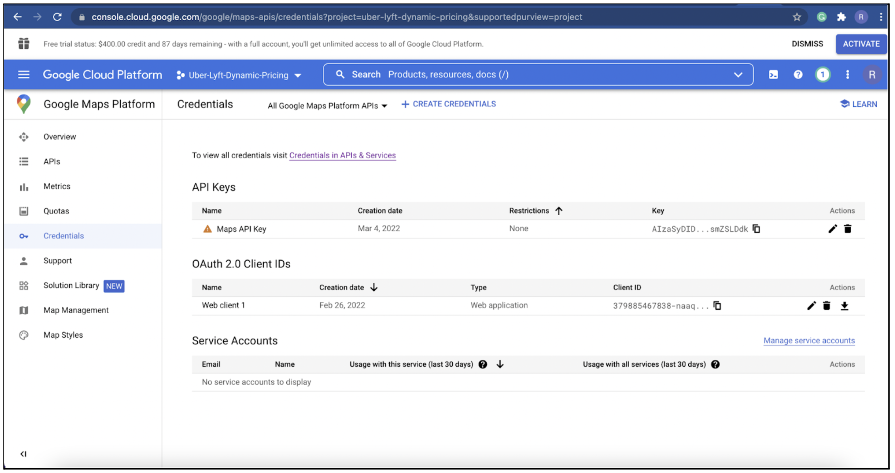
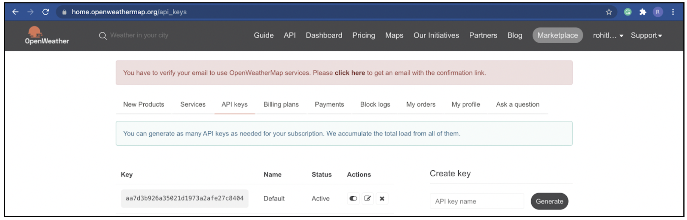

## API Documentation

### Following APIs have been used in the project:
- Google Maps API (Distance Matrix and Geocoding)
- Google Oauth API
- Openweathermap API  
  
 

### 1) Google Maps APIs  

#### API relevance
i) Distance Matrix API (from Google Maps): This API is used to access travel distance (in km) and time (in mins) for a matrix of origins and destinations.  
Documentation: [Overview|Distance Matrix API|Google Developers](https://developers.google.com/maps/documentation/distance-matrix/overview)

ii) Geocoding API (from Google Maps): This API is used to convert addresses (source and destination) into geographic coordinates (latitude and longitude)  
Documentation: [Overview|Geocoding API|Google Developers](https://developers.google.com/maps/documentation/geocoding/overview?hl=en_US)

#### API usage
Making the Distance Matrix and Geocoding API call: Required Parameters: Source address/Destination address and API key

#### Key generation steps
1) Create an account in Google Cloud Platform [Google Cloud Console](https://console.cloud.google.com/)
2) Create a new project:
   Once your account is created, 
   i) At the top-left, click Menu menu > IAM & Admin > Create a Project.
  ii) In the Project Name field, enter a descriptive name for your project.
   Optional: To edit the Project ID, click Edit. The project ID can't be changed after the project is created, so choose an ID that meets your needs for the lifetime of the project.
 iii) In the Location field, click Browse to display potential locations for your project. Then, click Select.
  iv) Click Create. The console navigates to the Dashboard page and your project is created within a few minutes.
3) Go to the Google Maps Platform option using top-left button < Credentials. 
4) On the Credentials page, click Create credentials > API key. Copy the API key to add to the software_configuration.py file.  
5) Go to Dashboard > APIs & Services and verify that Distance Matrix API and Geocoding API are present in the list of enabled services in your account to ensure error free usage of these APIs.

 
### 2) Google Oauth API key   

#### API relevance
Google APIs use the OAuth 2.0 protocol for authentication and authorization. Google supports common OAuth 2.0 scenarios such as those for web server, client-side, installed, and limited-input device applications.  
Documentation: [Using OAuth 2.0 to Access Google APIs](https://developers.google.com/identity/protocols/oauth2)

#### API usage
Pass the client ID, secret and access token obtained from google and add it to your application configuration. Call the relevant APIs.

#### Key generation steps 
1) Using the top-left button, go to APIs & Services > Create Credentials > Oauth Client ID  

2) Copy the client ID and Secret or download the JSON and add it to the software_configuration.py file.
 
 

If the above keys are generated successfully, following is the screenshot from the Google Cloud console.

 

### 3) Weather API (from OpenWeatherMap):   

#### API Relevance
This API is used to access current weather (clouds, destination, humidity, pressure, and wind) data for any location.   
Documentation: Current weather data - [OpenWeatherMap](https://openweathermap.org/current)  

#### API Usage
Required Parameters: Latitude, longitude, and API key
Python Request URL : https://api.openweathermap.org/data/2.5/onecall?lat=%s&lon=%s&appid=%s&units=metric" % (lat, lon, api_key)  

#### Key generation steps
1) Create a account on Openweathermap API [OpenWeathermap signup](https://home.openweathermap.org/users/sign_up)  
2) Once the email is verified, click on your email/name on the top right > My API keys > Type "Name" > Generate.
3) Copy the API key and add it to the JSON in the software_configuration.py file.

If the above keys are generated successfully, following is the screenshot from the OpenWeatherMap console.
  
 
  
 
**Note:** For generating the keys for Uber and Lyft APIs, the developers of the project are in talks with the engineers at these organizations to get the required access. This document will be updated once the server access tokens are granted.

